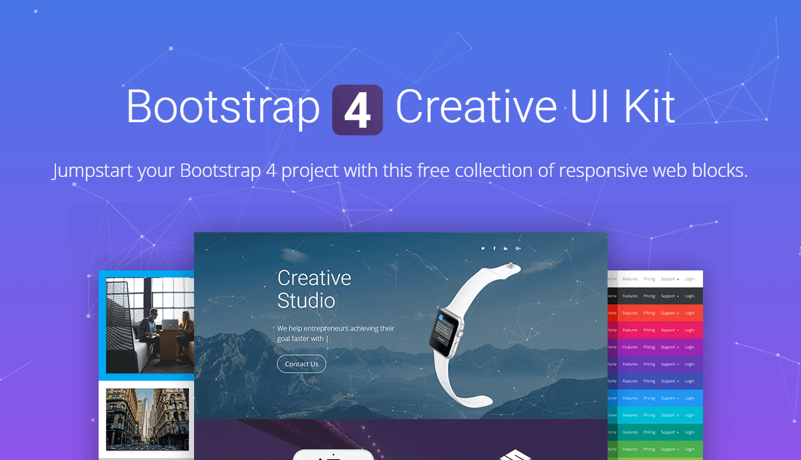
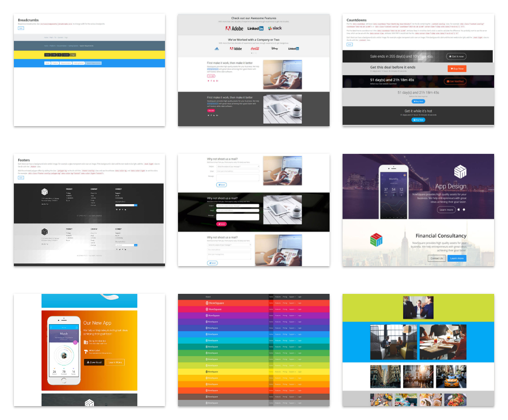

# Bootstrap 4 Creative UI Kit
**Jumpstart your Bootstrap 4 project with this free collection of responsive web blocks.**

Easy to work with and built upon Bower, GulpJS and Sass. Unlimited combinations and easy to customize. Create responsive websites with predefined html web blocks.

## Getting started
Copy the source the starter template (`html/template-blank.html`) to a file in your project. This file contains links to the required CSS and JavaScript files. Then, copy the directory `html/assets/` to your project. The directory structure should look like this:

 - `/awesome-project/assets/`
 - `/awesome-project/index.html`

You can now start copying blocks from files in the `html` directory to your project file. Explore blocks by opening `html/index.html`.

## Build from source

All web blocks, scripts and styles are available out-of-the-box. You can start right away without installing any of the libraries below. If you want to modify the stylesheets using Sass, follow the instructions below.

### Prerequisites

The libraries below are required if you want to build the stylesheets and javascript files.

 - [NodeJS](https://www.nodejs.org)
 - [NPM](https://www.npmjs.com)
 - [Bower](http://bower.io)
 - [Gulp](http://gulpjs.com)

### Installation
After you've downloaded the project, navigate to the root directory with your CLI.

#### Install required NPM packages
`$ npm install`

#### Install Bower JavaScript libraries
`$ bower install`

#### Troubleshooting
If you get the error `'sass' is not recognized as an internal or external command` when executing `gulp styles`, you have to install [Ruby](https://rubyinstaller.org). After installation execute `gem install sass` in your CLI.

### Modify CSS
Open the main Sass file `src/sass/style.scss` and modify it to suit your needs. After your changes, run `$ gulp styles` in your CLI to compile the new CSS to the `html/assets/css` directory. Open `gulpfile.js` for more details on what's going on.

### Modify JavaScript
Open a JavaScript file in the `src/scripts` directory and modify it as you wish. After your changes, run `$ gulp scripts` in your CLI to compile the JavaScripts to the `html/assets/js` directory.

## Special thanks
Special thanks go to the following resources:

 - https://dribbble.com/shots/1966404--Watch-Free-Templates
 - https://github.com/icons8/flat-color-icons
 - http://www.julessdesign.com/portfolio/mobile-ui-ux-design/iphone-6s-free-psd-mockup-4-angles-of-view-in-4-colors/
 - https://www.invisionapp.com/do
 - http://www.pixeden.com/psd-mock-up-templates/iphone-6-psd-vector-mockup
 - http://www.pixeden.com/psd-mock-up-templates/3d-view-iphone-6-psd-vector-mockup
 - http://www.pixeden.com/psd-mock-up-templates/psd-ipad-air-2-gravity-mockup
 - http://www.pixeden.com/psd-mock-up-templates/the-new-macbook-psd-mockup
 - http://www.pixeden.com/psd-mock-up-templates/cinema-display-psd-mockup

## License
Bootstrap 4 UI Kit
Copyright (C) 2016 NowSquare

This program is free software: you can redistribute it and/or modify
it under the terms of the GNU General Public License as published by
the Free Software Foundation, either version 3 of the License, or
(at your option) any later version.